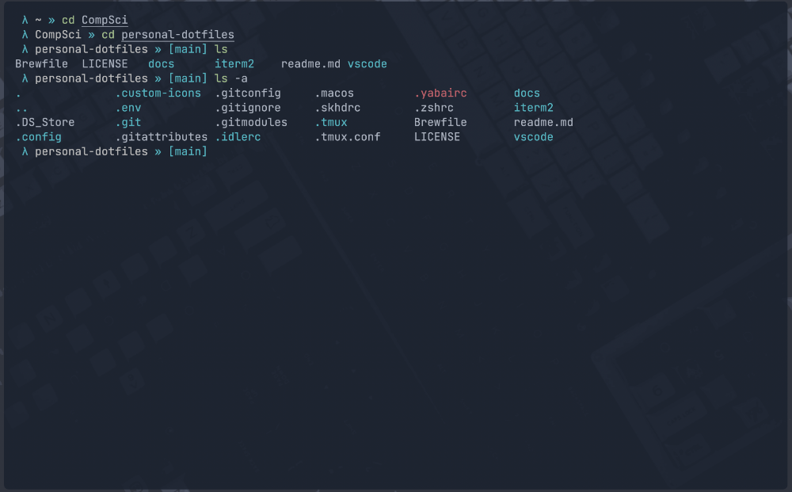
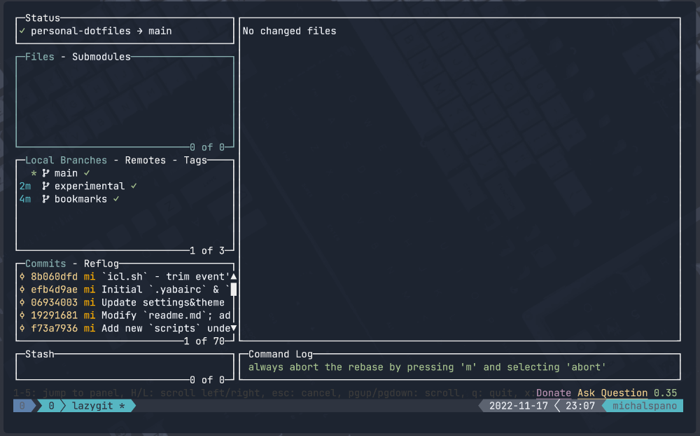
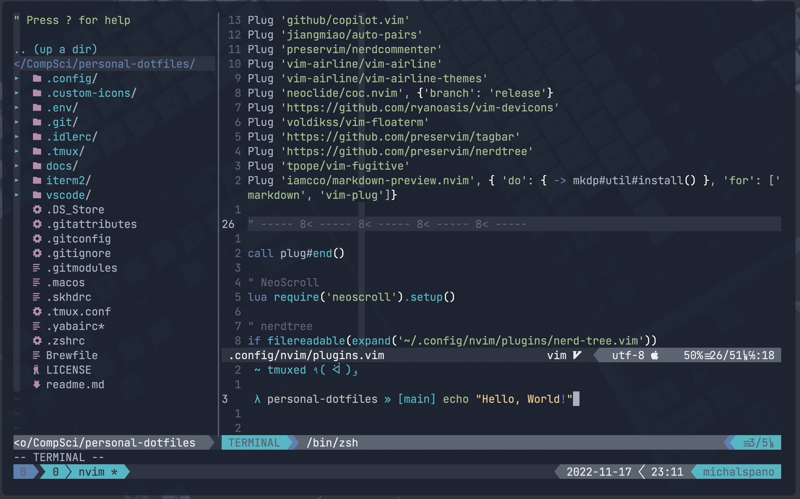
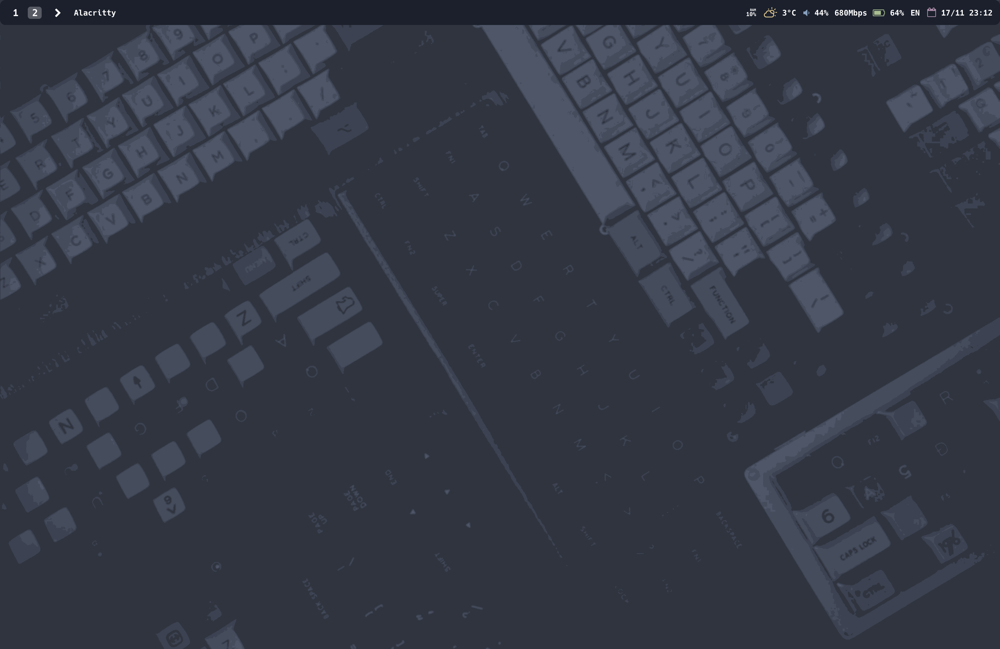
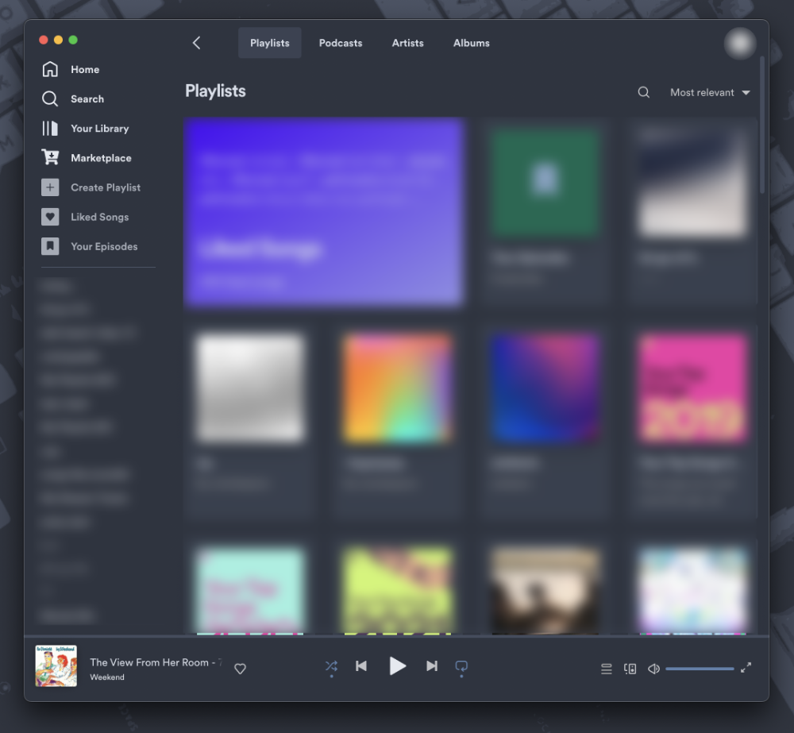
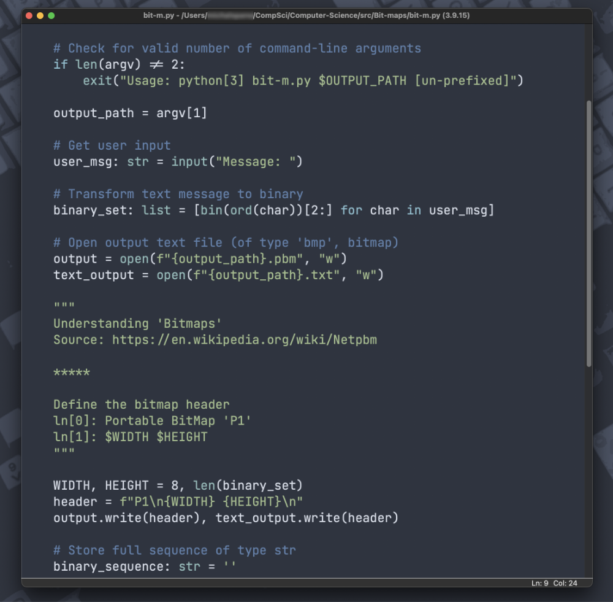
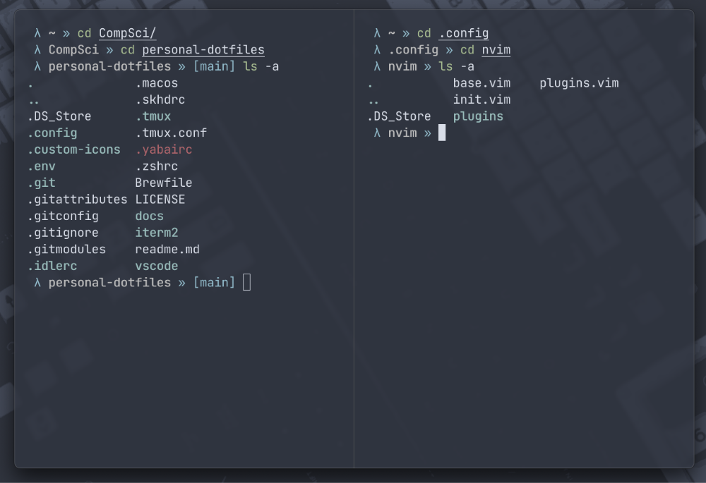

<h2 align="center">🔧 ~ dotfiles [macos]</h2>

### Branches:

1. [`stable`](https://github.com/michalspano/.dotfiles/tree/main)               [ `OK`  ]
2. [`experimental`](https://github.com/michalspano/.dotfiles/tree/experimental) [ `WIP` ]

## Previews

### `~/.config/*`

|            name            |                 preview                 |
|:--------------------------:|:---------------------------------------:|
| [`alacritty`][alacritty]\* |    |
|    [`lazygit`][lazygit]    |        |
|       [`nvim`][nvim]       |              |
| [`sketchybar`][sketchybar] |  |
|   [`spotify`][spicetify]   |        |

    
*additional <code>alacritty</code> themes.

    One can make use of the <code>alacritty-theme.sh</code> script found under <code>.env/</code>. If <code>alias.zsh</code> is used (as part of the <code>zsh</code> config.), the script automatically <i>aliased</i> to <code>al-sw</code>. The script takes one argument, which is the name of the theme to be set. The themes are loaded from the following location: <code>.config/alacritty/themes/</code>. The following table shows the available themes (within this repository); use <code>al-sw -h</code> for further information.

|       name       |                       preview                        |
|:----------------:|:----------------------------------------------------:|
|    `default`     |        ![alacritty-default-theme][al-default]        |
| `default-opaque` | ![alacritty-default-opaque-theme][al-default-opaque] |
|    `gruvbox`     |        ![alacritty-gruvbox-theme][al-gruvbox]        |
|      `nord`      |           ![alacritty-nord-theme][al-nord]           |
|  `nord-opaque`   |    ![alacritty-nord-opaque-theme][al-nord-opaque]    |
|    `one-dark`    |       ![alacritty-one-dark-theme][al-one-dark]       |
|     `snazzy`     |         ![alacritty-snazzy-theme][al-snazzy]         |

<!-- links -->

[alacritty]: https://github.com/alacritty/alacritty
[lazygit]: https://github.com/jesseduffield/lazygit
[nvim]: https://github.com/neovim/neovim
[sketchybar]: https://github.com/FelixKratz/SketchyBar
[spicetify]: https://spicetify.app/

<!-- additional alacritty themes -->
[al-default]: docs/alacritty-themes/default.png
[al-default-opaque]: docs/alacritty-themes/default-opaque.png
[al-gruvbox]: docs/alacritty-themes/gruvbox.png
[al-nord]: docs/alacritty-themes/nord.png
[al-nord-opaque]: docs/alacritty-themes/nord-opaque.png
[al-one-dark]: docs/alacritty-themes/one-dark.png
[al-snazzy]: docs/alacritty-themes/snazzy.png

### Others

|        name        |             preview             |
|:------------------:|:-------------------------------:|
|   [`idle`][idle]   |    |
|   [`tmux`][tmux]   |      |
| [`iterm2`][iterm2] |  |

<!-- links -->

[idle]: https://docs.python.org/3/library/idle.html
[tmux]: https://github.com/tmux/tmux
[iterm2]: https://github.com/gnachman/iTerm2

## Notes

Here I write some __notes__ that I consider important for the understanding of these `dotfiles`.

### Current Tiling Window Manager

I'm using the [`Amethyst`](https://github.com/ianyh/Amethyst) __tiling window manager__, though I'm trying to transition to [`yabai`](https://github.com/koekeishiya/yabai) at the present moment. The `yabai` tiling window manager requires the following: `.yabairc`, `.skhdrc`. Thus, I include them in this __repository__, although they are still _work in progress_. I plan to __fully__ switch to `yabai` in the future. 

### `macOS` & `unix`

I plan to create a __branch__ with configurations that are compatible with `unix` (not only `macOS`).
